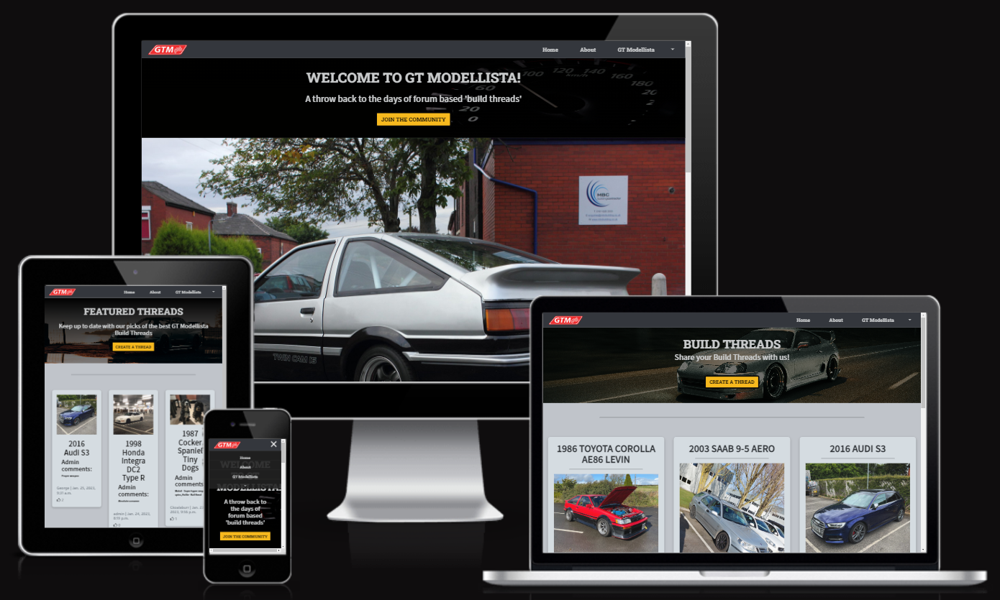

# **GT Modellista Blog - Introduction**
GT Modellista is blog site for car enthusiasts to share their passions with other like-minded individuals from around the world. This project is a Full-Stack development website built using the Django framework. GT Modellista allows registered users to post articles in two seperate categories, 'Build Threads' for vehicles and 'Diecasts' for scale-model collections. Registered users are also able to like and comment on posts made by other members of the community.

[GT Modellista](https://gt-modellista.herokuapp.com/) - The live site can be viewed here.

## **Table of Contents**
 - [**User Experience (UX)**](#user-experience)
    * [User Stories](#user-stories)
    * [Agile Methodology](#agile-methodology)
    * [The Scope](#the-scope)
 - [**Design**](#design)
    * [Colours](#colours)
    * [Typography](#typography)
    * [Media](#media)
    * [Database Schema](#database-schema)
    * [Wireframes](#wireframes)
 - [**Features**](#features)
 - [**Testing**](#testing)
 - [**Technologies Used**](#technology-used)
 - [**Deployment**](#deployment)
 - [**Credits**](#credits)

## **User Experience (UX)**

## **Design**

### **Wireframes**
[Home Page](docs/read-me/home-page.png)

[About Page](docs/read-me/about-page.png)

[Blog Page](docs/read-me/blog-page.png)

[Build Threads Page](docs/read-me/build-threads.png)

[Create Build Thread](docs/read-me/create-build-thread.png)

[Build Thread Posts](docs/read-me/view-build-thread-post.png)

[Diecasts Page](docs/read-me/diecasts.png)

[Create Diecasts Post](docs/read-me/create-diecasts.png)

[Diecasts Posts](docs/read-me/view-diecast-post.png)

[Partners and Sponsors Page](docs/read-me/partners.png)

[Partners/Sponsors Posts](docs/read-me/view-partners-post.png)

[Contact Us Page](docs/read-me/contact-us.png)

[Signup Page](docs/read-me/signup-page.png)

[Login Page](docs/read-me/login-page.png)

[Home Page](docs/read-me/home-page.png)
## **Features**

## **Testing**

## **Technologies Used**

## **Deployment**

## **Credits**