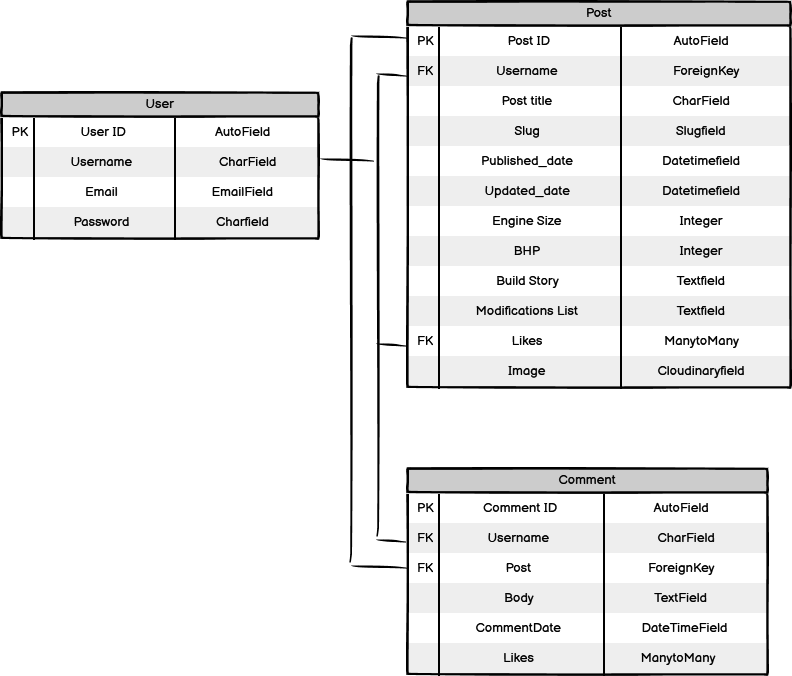

# **GT Modellista Blog - Introduction**
GT Modellista is blog site for car enthusiasts to share their passions with other like-minded individuals from around the world. This project is a Full-Stack development website built using the Django framework. GT Modellista allows registered users to post articles in two seperate categories, 'Build Threads' for vehicles and 'Diecasts' for scale-model collections. Registered users are also able to like and comment on posts made by other members of the community.

[GT Modellista](https://gt-modellista.herokuapp.com/) - The live site can be viewed here.

## **Table of Contents**
 - [**User Experience (UX)**](#user-experience)
    * [User Stories](#user-stories)
    * [Agile Methodology](#agile-methodology)
    * [The Scope](#the-scope)
 - [**Design**](#design)
    * [Colours](#colours)
    * [Typography](#typography)
    * [Media](#media)
    * [Database Schema](#database-schema)
    * [Wireframes](#wireframes)
 - [**Features**](#features)
 - [**Testing**](#testing)
 - [**Technologies Used**](#technology-used)
 - [**Deployment**](#deployment)
 - [**Credits**](#credits)

## **User Experience (UX)**

### **User Stories**
A list of my user stories can be found [here](https://github.com/AndyL86/gt-modellista/issues)

Unregistered site user:

- As a user, I can understand the site's purpose as soon as I land on the homepage.
- As a user, I can navigate the sites content without difficulty or confusion.
- As a user, I can view a list of all the blog posts in the 'Build Threads', 'Scale Models' and 'Partners and Sponsors' sections of the site.
- As a user, I can click on and view each blog post so I can view the content.
- As a user, I can view 'Featured Build Threads'.
- As a user, I can view how many likes each blog post has received.
- As a user, I can view the comments made on each blog post.
- As a user, I can easily locate and visit the social media links.
- As a user, I can sign up and register to the site.
- As a user, I can easily contact the site's Admin through the 'Contact Us' page.

Regsitered site user:

- As a user, I can perform the same actions as an unregistered site user.
- As a user, I can log in to allow me to create content and interact with the community.
- As a user, I can easily create a new blog post in the 'Build Threads' and 'Scale Models' sections of the site.
- As a user, I can edit/delete blog posts I have created.
- As a user, I can like/unlike blog posts.
- As a user, I can post comments on blog posts.
- As a user, I can edit/delete my comments on blog posts.
- As a user, I can view a list of the posts I have previously liked.

Site Admin/Superuser:

- As a user, I can perform the same functionalities as unregistered and registered users.
- As a user, I can create, edit and delete blog posts and post content to allow control over inappropriate content.
- As a user, I can manage the Build Threads feature functionality to maintain control over blog posts that are 'Featured Build Threads'.
- As a user, I can publish articles in the 'Sponsors and Partners' section of the site.

## **Design**

### **Wireframes**
Wireframes for each page are linked here:

[Home Page](docs/read-me/home-page.png)

[About Page](docs/read-me/about-page.png)

[Blog Page](docs/read-me/blog-page.png)

[Build Threads Page](docs/read-me/build-threads.png)

[Create Build Thread](docs/read-me/create-build-thread.png)

[Build Thread Posts](docs/read-me/view-build-thread-post.png)

[Diecasts Page](docs/read-me/diecasts.png)

[Create Diecasts Post](docs/read-me/create-diecasts.png)

[Diecasts Posts](docs/read-me/view-diecast-post.png)

[Partners and Sponsors Page](docs/read-me/partners.png)

[Partners/Sponsors Posts](docs/read-me/view-partners-post.png)

[Contact Us Page](docs/read-me/contact-us.png)

[Signup Page](docs/read-me/signup-page.png)

[Login Page](docs/read-me/login-page.png)

### **Database Schema**

## **Features**

## **Testing**

## **Technologies Used**

## **Deployment**

## **Credits**