# **GT Modellista Testing Documentation**

## **Table of contents**
 - [**Automated Testing**](#automated-testing)
 - [**HTML Validation**](#html-validation)
 - [**CSS Validation**](#css-validation)
 - [**Python Validation**](#python-validation)
 - [**Lighthouse**](#lighthouse)
 - [**Bugs and Issues**](#bugs-and-issues)

## **Automated Testing**

### **Automated Testing Results: 90%**
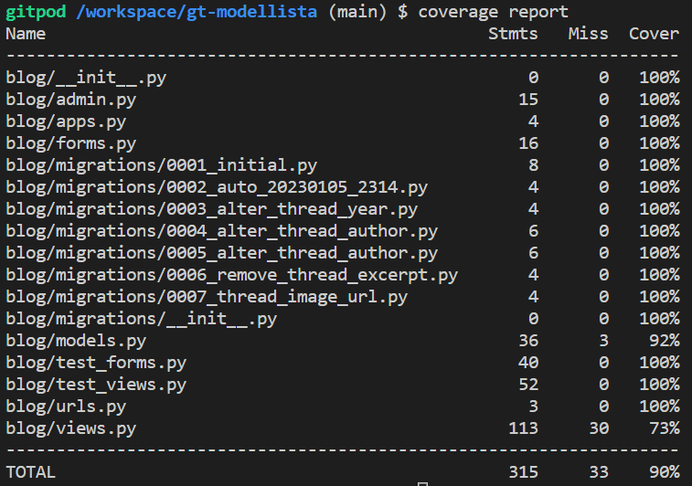
- Automated testing is an area that requires improvement, I ran into a number of roadblocks along the way due to lack of knowledge and time constraints.
- Test Views is the main area in need of improvement with a score of 73%. Further research will be conducted into how I can improve on this score.

## **HTML Validation**

All HTML code has been run through the [W3C - HTML](https://validator.w3.org/) validator and returns no errors, results can be viewed below:

#### **Index.html**
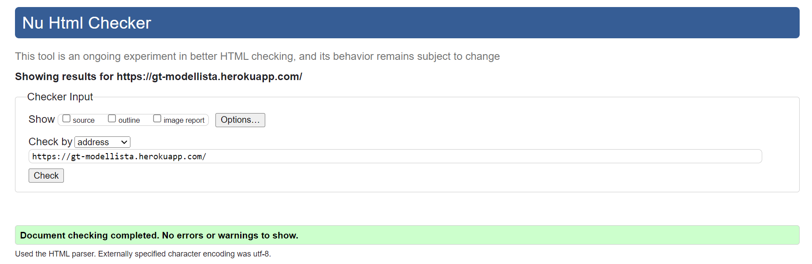

#### **About.html**
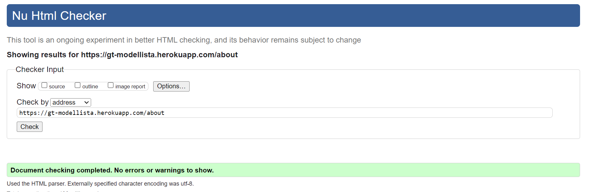

#### **Blog-list.html**
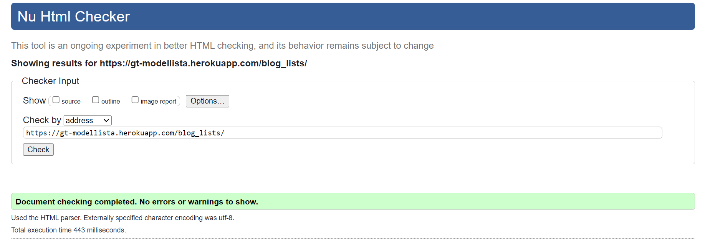

#### **Featured.html**
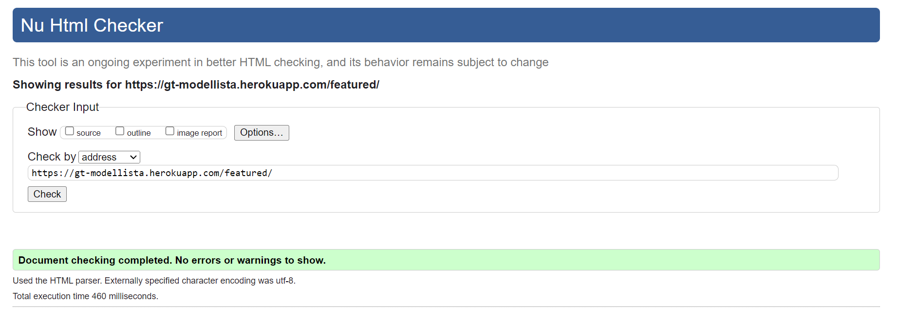

#### **My-threads.html**
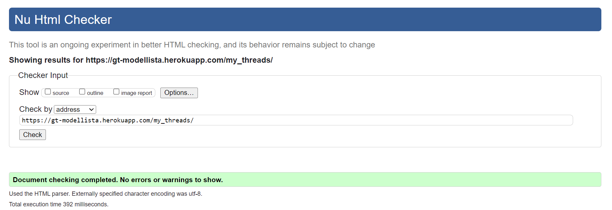

#### **Thread-detail.html**
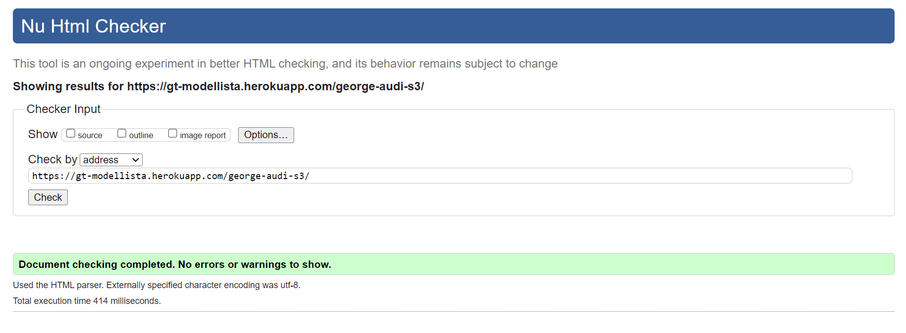

## **CSS Validation**

All CSS code has been run through the [W3C - CSS](https://jigsaw.w3.org/css-validator/) validator and returns no errors, results can be viewed below:

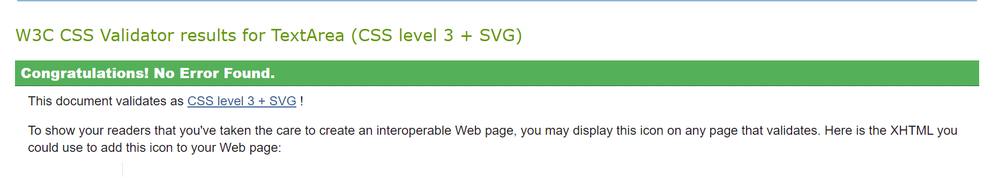

## **Python Validation**

All Python code has been run through the [CI PEP8 Testing](https://pep8ci.herokuapp.com/) validator and has returned no errors, results can be viewed below:

#### **admin.py**
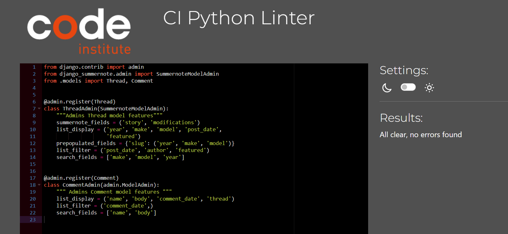

#### **app.py**
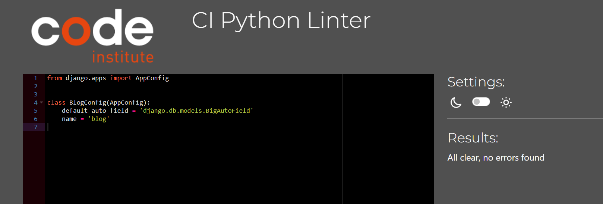

#### **forms.py**
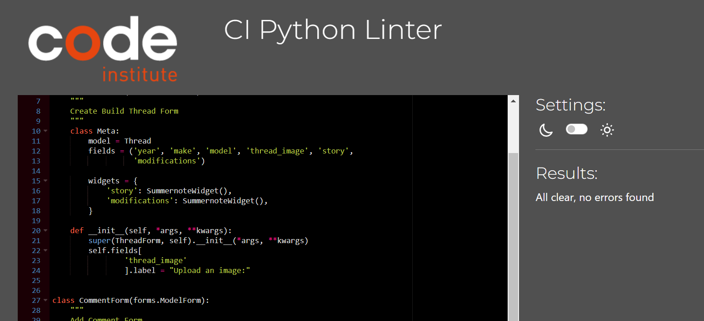

#### **models.py**
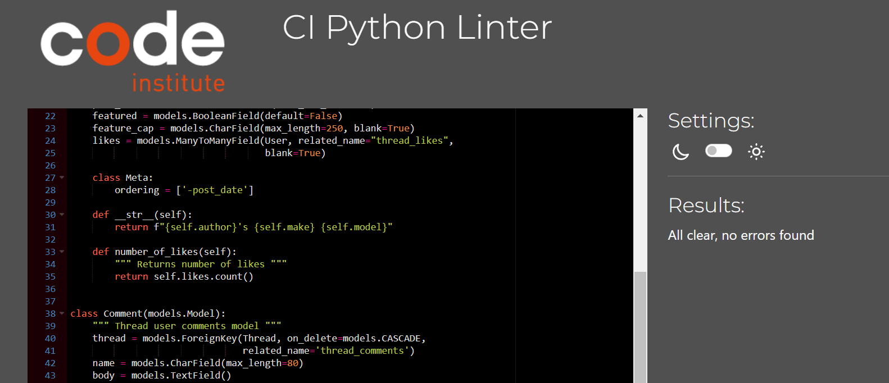

#### **urls.py**
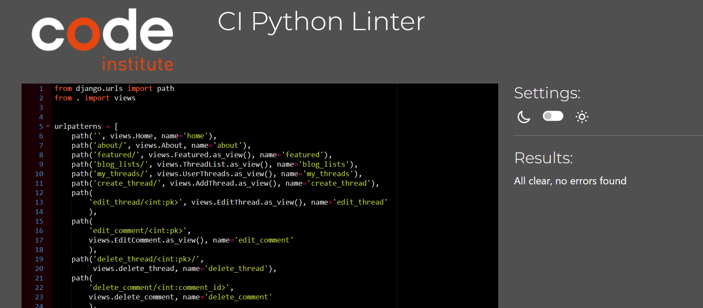

#### **views.py**

## **Lighthouse**
- The lighthouse score results can be found below. The main area for improvement is performance, however this low score is due to image file sizes being quite big. The purpose of these images was to test thread creation directly from a mobile or tablet device using the images stored on the device. This will be researched into how I can manage the image sizes for future applications.
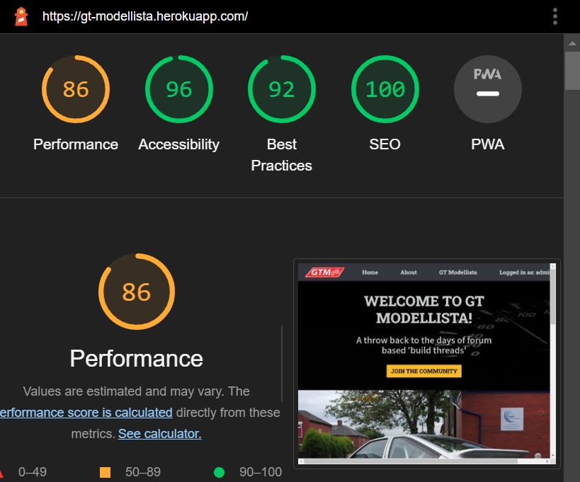

## **Bugs and Issues**
- One of the main bugs I encountered during development was my CSS file not being loaded upon deployment, only in the local Gitpod terminal. To remedy this, an application called 'whitenoise' was installed to pull the static files. For future applications I am going to research the cause of this issue.
- Additionally, an issue is still visible in devtools for a favicon 404 error. Unfortunately, I was unable to remedy this due to time constraints and lack of knowledge.
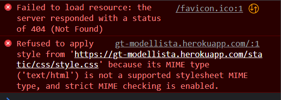

- I ran into a small issue with my delete thread button not working, this was remedied by correctly moving my closing div to fall within the if arguement of the authenticated user.

- Currently the like button icon style is loaded when users are not logged in. However, once a user is logged in the style for the icon disappears. I have tried to remedy this issue, however due to time constraints with the project hand in I was unable to fix this issue.