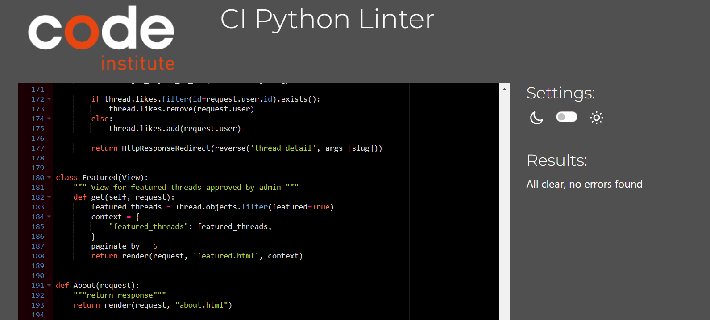

# **GT Modellista Testing Documentation**

## **Table of contents**

## **Automated Testing**

### **Automated Testing Results: 90%**

- Automated testing is an area that requires improvement, I ran into a number of roadblocks along the way and due to lack of knowledge and time constraints.
- Test Views is the main area in need of improvement with a score of 74%. Further research will be conducted into how I can improve on this score.

## **HTML Validation**

## **CSS Validation**

- My CSS code passed validation with no errors.

## **Python Validation**

#### **admin.py**

#### **app.py**

#### **forms.py**

#### **models.py**

#### **urls.py**

#### **views.py**

## **Lighthouse**

## **Bugs and Issues**